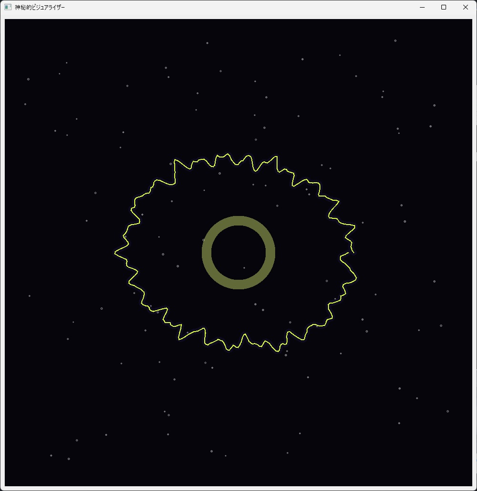

# win-audio-visualizer



Windows 11 向けオーディオビジュアライザーアプリケーション

## 概要

このアプリケーションは、Windows 11 上で再生されているすべてのシステム音声（例：Chrome、Spotify、通知音など）をリアルタイムで取得し、視覚的に表示するデスクトップアプリケーションです。WASAPI Loopback 機能を用いてスピーカー出力音をキャプチャし、リアルタイムでオーディオビジュアライザーとして画面に描画します。

## 機能

- Windows 11 のシステム音声をリアルタイムでキャプチャ
- 音声波形またはスペクトラム（FFT）をリアルタイムに描画
- シンプルなバーグラフ型スペクトラムを表示

## 必要条件

- Windows 11（WASAPI Loopback 対応必須）
- Python 3.8 以上

## インストール方法

```bash
# リポジトリのクローン
git clone https://github.com/big-mon/win-audio-visualizer.git
cd win-audio-visualizer

# 仮想環境の作成と有効化
python -m venv .venv
.venv\Scripts\activate

# 依存パッケージのインストール
pip install -r requirements.txt
```

## 使用方法

```bash
# アプリケーションの起動
python ./src/app.py
```

## 開発環境

- Python
- 主要ライブラリ:
  - sounddevice（WASAPI ループバックに対応）
  - numpy（FFT 処理）
  - pyqtgraph（可視化用）

## ライセンス

MIT ライセンス

## 貢献方法

1. このリポジトリをフォーク
2. feature ブランチを作成 (`git checkout -b feature/amazing-feature`)
3. 変更をコミット (`git commit -m 'feat: 素晴らしい機能を追加'`)
4. ブランチをプッシュ (`git push origin feature/amazing-feature`)
5. プルリクエストを作成
